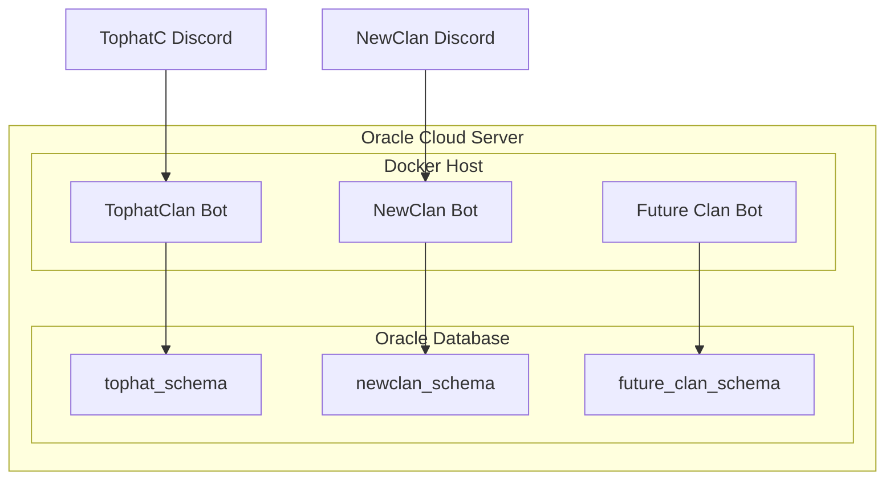

# Multi-Clan Bot Architecture Plan

## Architecture Overview



---

## Phase 1: Create Generic Base Project

### 1.1 Rename and Refactor Core Components

| Current | New ||---------|-----|| `TophatClanBot` class | `ClanBot` class || `tophat_clan.db` | `clan_data.db` (configurable via env) || Hardcoded "TophatC" references | Configurable `CLAN_NAME` env var |**Key files to modify:**

- [bot.py](bot.py) - Rename `TophatClanBot` to `ClanBot`, add `CLAN_NAME` config
- [config.py](config.py) - Add `CLAN_NAME`, `DATABASE_SCHEMA` environment variables

### 1.2 Externalize Default Ranks

Currently, default ranks are hardcoded in [database.py](database.py) (lines 114-156) and [database_oracle.py](database_oracle.py) (lines 256-305).**Solution:** Move ranks to a JSON configuration file loaded per-clan:

```javascript
configs/
  tophat/
    ranks.json
    settings.json
  newclan/
    ranks.json
    settings.json
```

Alternatively, make default ranks optional - let each clan configure ranks via `/setup-ranks` command on first boot.

### 1.3 Create Template Configuration

Enhance `setup_example.env` with all customizable options:

```bash
# Clan Identity
CLAN_NAME=YourClanName
DATABASE_SCHEMA=yourclan_schema

# Discord Configuration  
DISCORD_BOT_TOKEN=your_token
GUILD_ID=your_guild_id
```

---

## Phase 2: Oracle Multi-Schema Setup

### 2.1 Schema Isolation Strategy

Each clan gets their own Oracle schema with identical table structures:

```sql
-- Create schema for each clan
CREATE USER tophat_bot IDENTIFIED BY "password";
CREATE USER newclan_bot IDENTIFIED BY "password";

-- Grant permissions
GRANT CREATE SESSION, CREATE TABLE, UNLIMITED TABLESPACE TO tophat_bot;
GRANT CREATE SESSION, CREATE TABLE, UNLIMITED TABLESPACE TO newclan_bot;
```


### 2.2 Database Connection

The existing [database_oracle.py](database_oracle.py) already uses `ORACLE_USER` as the schema owner - each user owns their own schema in Oracle, so this works automatically.

### 2.3 Create Schema Setup Script

New file: `scripts/setup_oracle_schema.sql` - Idempotent script to create all tables for a new clan.---

## Phase 3: Multi-Instance Deployment

### 3.1 Docker Compose Per-Clan

Create deployment templates:

```javascript
deployments/
  tophat/
    docker-compose.yml
    .env
  newclan/
    docker-compose.yml
    .env
```

Each compose file uses the same image but different env vars and unique container names.

### 3.2 Shared Docker Image

Modify [Dockerfile](Dockerfile) to build a generic image - no clan-specific config baked in.

### 3.3 Systemd Service Templates (Optional)

For non-Docker deployments: `/etc/systemd/system/clan-bot@.service`Usage: `systemctl start clan-bot@tophat` or `clan-bot@newclan`---

## Phase 4: Documentation and Onboarding

Create `ONBOARDING_NEW_CLAN.md` covering:

1. Clone repository
2. Create Oracle schema  
3. Copy and configure `.env`
4. Configure Discord bot application
5. Configure Roblox group integration
6. Deploy and initialize

---

## Implementation Priority

| Priority | Task | Effort ||----------|------|--------|| 1 | Add `CLAN_NAME` config and rename bot class | Low || 2 | Create Oracle schema setup script | Low || 3 | Externalize default ranks to JSON | Medium || 4 | Create deployment templates | Medium || 5 | Write onboarding guide | Low |---

## Migration Path