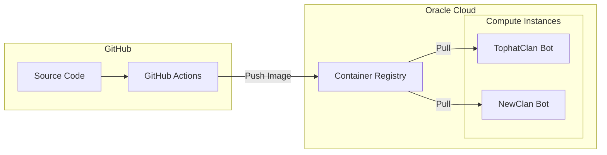

# OCIR Docker Image Push Plan

## Architecture



## Prerequisites

Before implementation, you'll need from Oracle Cloud Console:

- **Tenancy namespace** (found in Tenancy Details)
- **Auth token** for your Oracle user (User Settings > Auth Tokens > Generate Token)
- **Region identifier** (e.g., `iad` for Ashburn, `phx` for Phoenix)

OCIR URL format: `<region>.ocir.io/<tenancy-namespace>/<repo-name>`

---

## Phase 1: Add GitHub Secrets for OCIR

Add these secrets in GitHub repo settings (Settings > Secrets > Actions):

- `OCIR_REGION` - e.g., `iad.ocir.io`
- `OCIR_TENANCY` - your tenancy namespace
- `OCIR_USERNAME` - format: `<tenancy-namespace>/<username>` or `<tenancy-namespace>/oracleidentitycloudservice/<email>` for federated users
- `OCIR_TOKEN` - the auth token generated above

---

## Phase 2: Create OCIR Push Workflow

Create new workflow file `.github/workflows/ocir-build.yml`:

```yaml
name: Build and Push to OCIR

on:
  push:
    branches: [main]
    tags: ['v*']
  workflow_dispatch:

env:
  REGISTRY: ${{ secrets.OCIR_REGION }}
  IMAGE_NAME: ${{ secrets.OCIR_TENANCY }}/clanbot

jobs:
  build-and-push:
    runs-on: ubuntu-latest
    steps:
      - uses: actions/checkout@v4
      
      - uses: docker/setup-buildx-action@v3
      
      - name: Log in to OCIR
        uses: docker/login-action@v3
        with:
          registry: ${{ secrets.OCIR_REGION }}
          username: ${{ secrets.OCIR_USERNAME }}
          password: ${{ secrets.OCIR_TOKEN }}
      
      - name: Build and push
        uses: docker/build-push-action@v5
        with:
          context: .
          push: true
          tags: |
            ${{ env.REGISTRY }}/${{ env.IMAGE_NAME }}:latest
            ${{ env.REGISTRY }}/${{ env.IMAGE_NAME }}:${{ github.sha }}
          platforms: linux/amd64,linux/arm64
```

---

## Phase 3: Update Deployment Templates

Modify `deployments/tophat/docker-compose.yml` and `deployments/graves_family/docker-compose.yml` to pull from OCIR:

```yaml
services:
  bot:
    image: ${OCIR_REGION}/${OCIR_TENANCY}/clanbot:latest
    # Remove 'build:' section - use pre-built image
```

Add to each deployment's `.env`:

```bash
OCIR_REGION=iad.ocir.io
OCIR_TENANCY=your-tenancy-namespace
```

---

## Phase 4: Configure Oracle Instances to Pull

On each Oracle compute instance, authenticate with OCIR before pulling:

```bash
docker login <region>.ocir.io -u '<tenancy>/<username>' -p '<auth-token>'
```

For automation, create `/etc/docker/config.json` with credentials or use instance principal authentication (recommended for production).

---

## Files to Create/Modify

| File | Action |

|------|--------|

| `.github/workflows/ocir-build.yml` | Create - new OCIR push workflow |

| `deployments/tophat/docker-compose.yml` | Modify - use OCIR image |

| `deployments/graves_family/docker-compose.yml` | Modify - use OCIR image |

| `ONBOARDING_NEW_CLAN.md` | Modify - add OCIR pull instructions |

---

## Security Notes

- OCIR images are **private by default** - only authenticated users in your tenancy can pull
- Auth tokens should be rotated periodically (they expire after configurable periods)
- Consider using OCI Instance Principals for compute instances instead of storing credentials